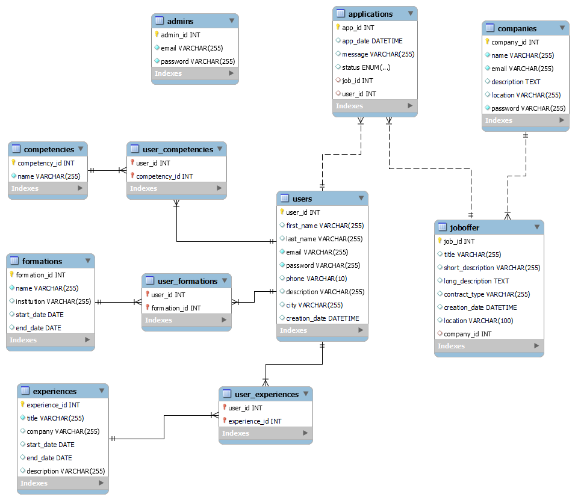

# JobBoard project

This application is a web platform designed to centralize and streamline the recruitment process for companies while offering an accessible space for candidates to easily apply for job postings.

The goal of this application is to create a space where recruiters can publish job listings, track applications, and manage company information. Candidates can explore job openings, apply and upload their resumes.

## Functionalities Overview

### Users
- A user can register and log in using their email and password.
- Once logged in, a user can access their profile page.
- Users can:
  - View their first name and last name (non-editable).
  - Add, modify, or delete:
    - Email
    - Password (used for authentication)
    - Phone number
    - Description
    - City
    - Skills
    - Education (formations)
    - Work experiences
- Users can view job offers and apply to them.
  - Applications are pre-filled with the user's profile information.
  - Users can add a personalized message to their application.
- Users have access to their application history and can view the status of their applications (`in progress`, `accepted`, `rejected`).

### Companies
- A company can log in using an email and password.
- Once logged in, a company can:
  - Edit their profile information (name, description, location).
  - Create and delete job offers.
  - View details of all job offers.
  - Update the status of applications (`in progress`, `accepted`, `rejected`).

### Administrators
- Administrators log in with specific credentials.
- Administrators have access to a special dashboard where they can:
  - View, edit, or delete:
    - All users
    - All companies
    - All job offers
    - All applications

## Tech Stack

**Client:** Angular TailwindCSS

**Server:** Developed in C# with ASP.NET Core, following an MVC architecture.
 

**Database:** SQL 

## UML Diagram

Here is the UML diagram of the database structure:

CREATION DU BACKEND  

* Installer .NET SDK : https://dotnet.microsoft.com/download  
* Commande : dotnet --version  
* dotnet new webapi -n NameProject  
* cd NameProject  
* dotnet run  

1. Dossier bin : Contient les fichiers compilés.  
2. Dossier obj : Contient les fichiers intermédiaire de compilation.  
3. Dossier Properties : Contient les fichiers de configuration du projet.  
4. Program.cs : Fichier principal où l'exécution de l'application démarre. 
5. appsettings.json : Contient les configurations, comme la connexion à la base de données.   
6. backend.csproj : Fichier avec les dépendances et configurations du projet.  
7. backend.http : Fichier pour tester les requêtes HTTP.

## Stucture des modèles et relations 

1. Modèles (Entities)  
Chaque entité correspond à une table dans la base de données.

1.1 Liste des entités principales  

* Users : Représente les utilisateurs de l'application (candidats).
* Companies : Représente les entreprises qui publient des offres d'emploi.
* Joboffer : Représente les offres d'emploi créées par les entreprises.
* Applications : Représente les candidatures soumises par les utilisateurs.
* Competencies : Représente les compétences des utilisateurs.
* Formations : Représente les formations des utilisateurs.
* Experiences : Représente les expériences professionnelles des utilisateurs.
* Admins : Représente les administrateurs ayant accès à toutes les données.

1.2. Tables de liaison pour les relations Many-to-Many  

Certaines relations nécessitent des tables intermédiaires pour gérer les liens :

* UserCompetencies : Liaison entre les utilisateurs et leurs compétences.
* UserFormations : Liaison entre les utilisateurs et leurs formations.
* UserExperiences : Liaison entre les utilisateurs et leurs expériences professionnelles.

Annoté avec [Key] ou [Column("nomColonneDb")] ou [Required] pour s'assurer que le paramètre ne peut être null. 

2. Relations

Users → Applications : One-To-Many : Un utilisateur peut soumettre plusieurs candidatures (Applications).

JobOffer → Applications : One-To-Many : Une offre d'emploi peut recevoir plusieurs candidature (Applications). 

Companies → Joboffer : One-to-Many : Une entreprise peut créer plusieurs offres d'emploi.

Users → Competencies : Many-to-Many : Un utilisateur peut avoir plusieurs compétences.

Users → Formations : Many-to-Many : Un utilisateur peut avoir suivi plusieurs formations.

Users → Experiences : Many-to-Many : Un utilisateur peut avoir plusieurs expériences professionnelles.

Mapping des relations One-To-Many 

Exemple dans User (Many Applications) : 
public ICollection<Applications>? Applications { get; set; }

Dans Applications : 
[Column("user_id")]
public int UserId {get; set; }

[ForeignKey("UserId")]
public Users? User ;

3. Connection à la database et JobBoardContext

* Modifier appsettings.json avec les données de connection (.gitignore, pour garder mes données de connection secrète) 

* Création d'une classe JobBoardContext : une classe centrale qui connecte les entités à la base de données et configure leurs relations. (Mapping des entité dans les tables de la bdd, configure les relation entre les entité, exécute les queries et sauvegarde les changement dans la base de données)

* Cette classe hérite de DbContext : 
"dotnet add package Microsoft.EntityFrameworkCore" 
"dotnet add package Pomelo.EntityFrameworkCore.MySql"

  1. DbSet : représente la table de la base de donnée

public DbSet<Users> Users { get; set; }
public DbSet<Applications> Applications { get; set; }
public DbSet<Companies> Companies { get; set; }

  2. Configuration des relations : Overide de la méthode OnModelCreating. Permet de configurer les relations Many-To-One et Many-To-Many

Exemple de Users avec Applications (Many-To-One)

protected override void OnModelCreating(ModelBuilder modelBuilder)
  {
     base.OnModelCreating(modelBuilder);

      //relation Many-To-One
      modelBuilder.Entity<Applications>()
        .HasOne(a => a.User)
        .WithMany(u => u.Applications)
        .HasForeignKey(a => a.UserId)
        .OnDelete(DeleteBehavior.Cascade);
  }

 3. Pour loader la connection : constructeur appel les options de connexion :  
 public JobBoardContext(DbContextOptions<JobBoardContext> options) : base(options){} 

